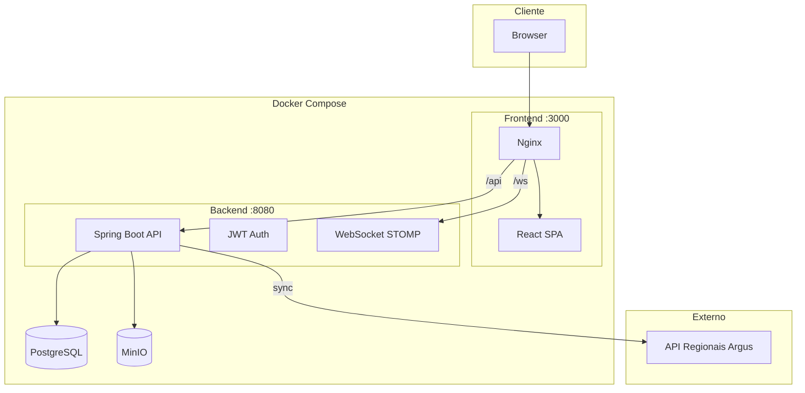

# SEPLAG/MT - Sistema de Álbuns Musicais

**Edital nº 397** | Secretaria de Estado de Planejamento e Gestão - Mato Grosso

---

## Identificação do Candidato

| Campo | Valor |
|-------|-------|
| **Candidato** | Carlos Daniel Alves Dias |
| **Inscrição** | 068174***-** |
| **Vaga** | Full Stack Sênior - Java + React |

---

## Objetivo do Projeto

Sistema Full Stack para gerenciamento de artistas e álbuns musicais, desenvolvido como prova técnica do processo seletivo. Permite cadastro, edição e exclusão de artistas e álbuns, upload de capas e fotos em armazenamento objeto (MinIO), autenticação JWT, notificações em tempo real via WebSocket e sincronização com API externa de regionais.

---

## Tecnologias Utilizadas

| Tecnologia | Versão | Uso |
|------------|--------|-----|
| Java | 17 | Backend |
| Spring Boot | 3.5 | API REST |
| Node.js | 18+ | Build frontend |
| React | 19 | Interface |
| TypeScript | 5.x | Tipagem frontend |
| PostgreSQL | 15 | Banco de dados |
| MinIO | - | Armazenamento S3-compatível |
| Docker / Docker Compose | - | Orquestração |
| Tailwind CSS | - | Estilização |
| RxJS | - | Reatividade (BehaviorSubject) |

---

## Arquitetura



- **Frontend:** React 19 + TypeScript, Tailwind CSS, RxJS (BehaviorSubject), Padrão Facade
- **Backend:** Spring Boot 3.5, JWT, Flyway, MinIO (S3), WebSocket STOMP
- **Infra:** PostgreSQL 15, MinIO, Docker Compose

---

## Decisões Técnicas

| Decisão | Justificativa |
|---------|---------------|
| **STOMP sobre SockJS** | Compatibilidade com Spring WebSocket, fallback para navegadores sem WebSocket nativo |
| **Facade + BehaviorSubject** | Centralização de estado e API, reatividade com RxJS |
| **Flyway Migrations** | Versionamento de schema, histórico auditável |
| **Presigned URLs (30 min)** | Acesso seguro ao MinIO sem expor credenciais |
| **Rate limit 10 req/min** | Proteção contra abuso, conforme especificação |
| **Liveness/Readiness probes** | Orquestração (Kubernetes/Docker) e monitoramento |

---

## Estrutura de Dados

### Tabelas principais

| Tabela | Descrição |
|--------|-----------|
| `usuarios` | Usuários do sistema (login, roles) |
| `artistas` | Artistas/bandas (nome, foto no MinIO) |
| `albuns` | Álbuns vinculados a artistas |
| `capas_album` | Capas dos álbuns (armazenadas no MinIO) |
| `regionais` | Regionais da Polícia Civil (sync com API Argus) |

### Relacionamentos

- `albuns` → `artistas` (N:1)
- `albuns` → `usuarios` (quem cadastrou)
- `capas_album` → `albuns` (N:1)

---

## Pré-requisitos

- **Java 17** (execução local do backend)
- **Node.js 18+** (execução local do frontend)
- **Docker e Docker Compose** (execução containerizada)
- **PostgreSQL 15** (ou via Docker)
- **MinIO** (ou via Docker)

---

## Instruções de Instalação e Execução

### Opção A: Com Docker (recomendado)

1. Certifique-se de ter Docker e Docker Compose instalados.
2. No diretório raiz do projeto, execute:
   ```bash
   docker compose up -d --build
   ```
3. Aguarde a inicialização dos serviços (cerca de 1–2 minutos).
4. Acesse o frontend em http://localhost:3000 e a API em http://localhost:8080.

| Serviço | URL | Porta |
|---------|-----|-------|
| Backend API | http://localhost:8080 | 8080 |
| Frontend | http://localhost:3000 | 3000 |
| Swagger UI | http://localhost:8080/swagger-ui.html | - |
| MinIO Console | http://localhost:9001 | 9001 |
| PostgreSQL | localhost:5432 | 5432 |

### Opção B: Execução local

1. Subir apenas Postgres e MinIO: `docker compose up -d postgres minio`
2. Backend: `cd backend && ./mvnw spring-boot:run` (ou `mvnw.cmd` no Windows)
3. Frontend: `cd frontend && npm install && npm run dev`
4. Acesse o frontend em http://localhost:3000 (ou porta indicada pelo Vite).

---

## Como Testar

### Backend

```bash
cd backend
./mvnw test
```

### Frontend

```bash
cd frontend
npm run test
```

---

## Variáveis de Ambiente

| Variável | Descrição | Padrão |
|----------|-----------|--------|
| `SPRING_DATASOURCE_URL` | URL do PostgreSQL | `jdbc:postgresql://localhost:5432/seplag_db` |
| `SPRING_DATASOURCE_USERNAME` | Usuário do banco | `seplag_user` |
| `SPRING_DATASOURCE_PASSWORD` | Senha do banco | `seplag_pass` |
| `MINIO_ENDPOINT` | URL do MinIO | `http://localhost:9000` |
| `MINIO_ACCESS_KEY` | Chave de acesso MinIO | `minioadmin` |
| `MINIO_SECRET_KEY` | Chave secreta MinIO | `minioadmin` |
| `JWT_SECRET` | Chave secreta JWT | `seplag-secret-key-change-in-production` |
| `JWT_EXPIRATION` | Expiração do token (ms) | `300000` (5 min) |
| `FRONTEND_URL` | URL do frontend (CORS) | `http://localhost:3000` |
| `VITE_API_URL` | URL da API (build frontend) | `http://localhost:8080/api/v1` |
| `VITE_WS_URL` | URL WebSocket (build frontend) | `ws://localhost:8080/ws` |

---

## Usuário Padrão

Após a primeira execução (migrations aplicadas):

- **Usuário:** `admin`
- **Senha:** `admin123`

---

## Documentação da API (Swagger)

- **Swagger UI:** http://localhost:8080/swagger-ui.html
- **OpenAPI JSON:** http://localhost:8080/v3/api-docs

### Exemplos de contratos

**Criar álbum** (POST `/api/v1/albuns`):
```json
{
  "titulo": "Nome do álbum",
  "artistaId": 1,
  "dataLancamento": "2024-01-15"
}
```

**Criar artista** (POST `/api/v1/artistas`):
```json
{
  "nome": "Nome do artista",
  "genero": "Rock",
  "biografia": "Biografia opcional"
}
```

---

## Requisitos Atendidos

### Backend
- [x] CRUD artistas e álbuns (POST, PUT, GET)
- [x] JWT com expiração 5 min e refresh
- [x] Paginação em álbuns
- [x] Consultas parametrizadas (por artista)
- [x] Consulta por nome com ordenação asc/desc
- [x] Upload de capas no MinIO
- [x] Presigned URLs 30 min
- [x] Flyway Migrations
- [x] Swagger/OpenAPI
- [x] CORS configurado
- [x] Rate limit 10 req/min por usuário
- [x] WebSocket STOMP (notificações de álbuns)
- [x] Sincronização regionais (API Argus): novo, inativar, atributo alterado
- [x] Health probes (Liveness/Readiness)
- [x] Testes unitários (JUnit 5/Mockito)

### Frontend
- [x] Tela inicial (artistas, busca, ordenação, paginação)
- [x] Tela detalhe artista (álbuns, capas)
- [x] Tela cadastro/edição (artistas, álbuns, upload)
- [x] Autenticação JWT (login, refresh, logout)
- [x] Padrão Facade + BehaviorSubject
- [x] Layout responsivo (Tailwind)
- [x] Lazy loading de rotas
- [x] WebSocket STOMP (notificações em tempo real)
- [x] Testes unitários (Vitest + Testing Library)

### Infra
- [x] Docker Compose (API, Frontend, Postgres, MinIO)
- [x] Health checks nos containers

---

## Estrutura do Projeto

```
carlosdanielalvesdias068174/
├── backend/              # API Spring Boot (Java 17)
│   ├── src/main/java/
│   ├── src/main/resources/db/migration/
│   └── pom.xml
├── frontend/             # React + TypeScript
│   ├── src/
│   │   ├── components/
│   │   ├── pages/
│   │   ├── services/     # Facade services
│   │   └── contexts/
│   └── package.json
├── docker-compose.yml
└── README.md
```

---

## Observações

Este projeto foi desenvolvido para o processo seletivo da SEPLAG/MT (Edital nº 397). O código é de uso exclusivo para avaliação técnica. Documentação autocontida: todas as informações necessárias para execução e avaliação estão neste README.
